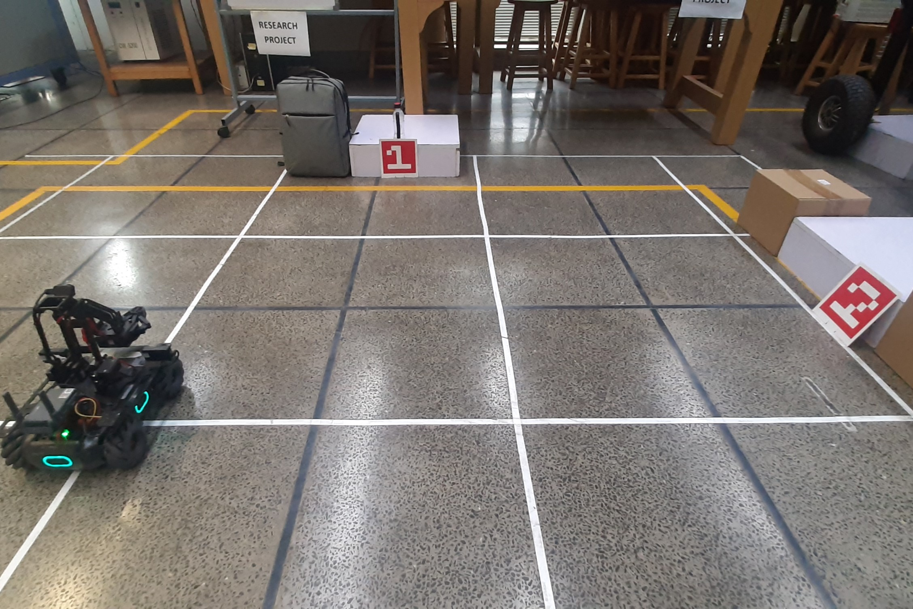

<h1> Pick and Place Project using Marker Detection and PID Control </h1>

<h2> Overview </h2>
This project utilizes a Robomaster robot, equipped with computer vision and sensor capabilities, to perform a pick and place task in a simulated environment. The robot is programmed to detect specific markers, navigate to them, grab an object, and then drop the object at another marker location.

![showcase][demo_third_person.mp4]

<h2> Key Features </h2>
- Real-time marker detection using computer vision
- PID control for precise navigation and alignment with the markers
- Seamless integration of robotic arm, gripper, and chassis controls for the pick and place operation
- Utilization of sensor data for distance monitoring and alignment adjustments

<h2> Included Files </h2>
The project consists of the following files:

- Pick_&_Drop.py: The main Python script that implements the pick and place logic, including marker detection, navigation, and object manipulation.
- setup.jpg: An image of the simulated environment and the Robomaster robot.
- demo robot_pov.mp4: A video demonstration of the project in action from the robot's point of view.
- demo third_person: A video demonstration of the project in action from a third person point of view.

<h2> Installation and Setup </h2>
Ensure that you have the following dependencies installed:

1. ROS (Robotic Operating System)
2. OpenCV
3. Robomaster SDK
4. Numpy
5. Matplotlib (optional, for visualization)
6. Clone the repository to your local machine.
7. Place the Pick_&_Drop.py script in your ROS workspace's src directory.
8. Build the ROS workspace using catkin_make or catkin build.
9. Run the Pick_&_Drop.py script using the following command:
10. Copy
'rosrun <your_package_name> Pick_&_Drop.py'

<h2> How the Code Works </h2>
The Pick_&_Drop.py script performs the following steps:

1. Initializes the Robomaster robot and its various components (vision, chassis, sensor, gripper, and robotic arm).
2. Starts the video stream and subscribes to the marker detection service.
3. Implements a PID controller to precisely align the robot with the first marker.
4. Navigates the robot towards the first marker, aligns it, and then grabs the object.
5. Detects the second marker, aligns the robot with it, and then drops the object at the second marker location.
6. Closes the video stream and disconnects the robot.
7. The script utilizes the Robomaster SDK to control the robot's movements, sensor data, and end-effector (gripper and robotic arm) operations. It also incorporates PID control to ensure accurate navigation and alignment with the markers.

<h2> Demonstration </h2>
A video demonstration of the project can be found in the demo.mp4 file. The video showcases the robot's ability to detect markers, navigate to them, pick up an object, and then place it at the second marker location.

<h2> Contribution </h2>
Contributions to this project are welcome. If you have any suggestions, bug reports, or improvements, please feel free to open an issue or submit a pull request on the project's GitHub repository.